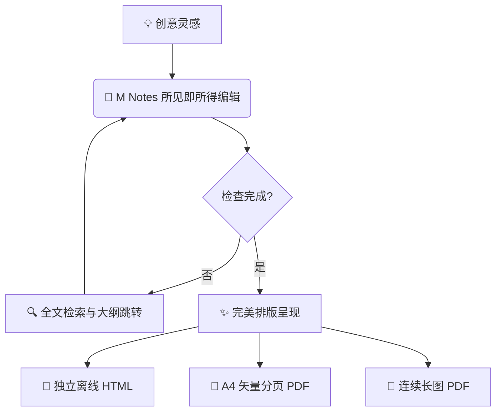

# M Notes 📝

![M Notes Banner](data:image/svg+xml;utf8,%3Csvg%20xmlns%3D%27http%3A%2F%2Fwww.w3.org%2F2000%2Fsvg%27%20width%3D%27800%27%20height%3D%27140%27%20viewBox%3D%270%200%20800%20140%27%3E%3Cdefs%3E%3ClinearGradient%20id%3D%27g%27%20x1%3D%270%25%27%20y1%3D%270%25%27%20x2%3D%27100%25%27%20y2%3D%27100%25%27%3E%3Cstop%20offset%3D%270%25%27%20stop-color%3D%27%233B82F6%27%2F%3E%3Cstop%20offset%3D%2750%25%27%20stop-color%3D%27%236366F1%27%2F%3E%3Cstop%20offset%3D%27100%25%27%20stop-color%3D%27%238B5CF6%27%2F%3E%3C%2FlinearGradient%3E%3C%2Fdefs%3E%3Crect%20width%3D%27100%25%27%20height%3D%27100%25%27%20rx%3D%2712%27%20fill%3D%27url%28%23g%29%27%2F%3E%3Ctext%20x%3D%2750%25%27%20y%3D%2745%25%27%20dominant-baseline%3D%27middle%27%20text-anchor%3D%27middle%27%20font-family%3D%27system-ui%2C%20sans-serif%27%20font-size%3D%2728%27%20font-weight%3D%27800%27%20fill%3D%27white%27%3EM%20Notes%20for%20macOS%3C%2Ftext%3E%3Ctext%20x%3D%2750%25%27%20y%3D%2772%25%27%20dominant-baseline%3D%27middle%27%20text-anchor%3D%27middle%27%20font-family%3D%27system-ui%2C%20sans-serif%27%20font-size%3D%2715%27%20fill%3D%27%23EEF2FF%27%3EWYSIWYG%20%E2%80%A2%20Mermaid%20%E2%80%A2%20KaTeX%20%E2%80%A2%20Interactive%20Tables%20%E2%80%A2%20A4%20Vector%20PDF%3C%2Ftext%3E%3C%2Fsvg%3E)

> **现代化 macOS 所见即所得 Markdown 与纯文本编辑器**
>
> *Native macOS WYSIWYG Markdown & Plain-Text Editor*


---

## 🌟 核心特性 (Features)

- ✨ **所见即所得原生编辑 (True WYSIWYG)**：融合源码与渲染视图，非光标所在行自动零宽度折叠隐藏 Markdown 语法标记（`#`、`**`、`~~` 等），光标移入时自然展开编辑。
- 📊 **Mermaid 丰富图表**：开箱即用支持流程图 (Flowchart)、时序图 (Sequence Diagram)、状态图、甘特图与 Git 版本树。
- 🧮 **KaTeX 数学公式**：毫秒级渲染行内公式（`$E=mc^2$`）与多行复杂矩阵、微积分方程组（`$$`）。
- 📑 **交互式表格 (Live Tables)**：支持电子表格般的快捷增删行列 (`⌘⌥↓` / `⌘⌥⌫` / `⌘⌥→` / `⌘⌥⇧⌫`) 和 `Tab` 流畅跳转。
- ☑️ **交互式任务清单**：支持一键点击切换 `- [x]` 任务勾选状态。
- 🖼️ **多媒体集成**：直接拖拽置入图片、点选修改图片路径。
- 💻 **多语言代码块高亮**：Swift、Rust、Python、JavaScript、Go 等数十种语言高亮，配有一键复制代码按钮。
- 🔍 **全局跨文档搜索与大纲**：`⌘⇧F` 快速检索所有近期文档，`⌘⌥O` 浮动大纲快速跳转。
- 🖨️ **高质量矢量导出**：支持分页 A4 矢量 PDF、单页连续长图 PDF 以及免依赖独立离线 HTML 导出。
- 🌐 **全双语支持**：中文与英文界面无缝切换。

---

## 📖 Markdown 与排版功能全览

### 1. 标题与语法零占位隐藏 (Zero-Width Heading & Syntax)

> 💡 当光标离开标题行时，`#` 符号会被零宽度隐藏，排版如同阅读已发布的出版物；当光标移入该行，`#` 会自然展开供您编辑。

# 一级标题 (Header 1)
## 二级标题 (Header 2)
### 三级标题 (Header 3)
#### 四级标题 (Header 4)
##### 五级标题 (Header 5)
###### 六级标题 (Header 6)

### 2. 文本强调与引用

- **粗体强调 (`⌘B`)**：`**粗体文本**`
- *斜体强调 (`⌘I`)*：`*斜体文本*`
- ***粗斜体结合***：`***粗斜体文本***`
- ~~删除线效果~~：`~~删除线文本~~`
- `行内代码`：`` `inline code` ``
- [GitHub 官方主页](https://github.com)：`[显示文本](URL)`

> 优雅是唯一不会褪色的美。
>
> — 奥黛丽·赫本
>
>> 支持在引用中嵌套多层批注与讨论。

### 3. 多媒体与图片 (Media & Images)

![M Notes Banner](data:image/svg+xml;utf8,%3Csvg%20xmlns%3D%27http%3A%2F%2Fwww.w3.org%2F2000%2Fsvg%27%20width%3D%27800%27%20height%3D%27140%27%20viewBox%3D%270%200%20800%20140%27%3E%3Cdefs%3E%3ClinearGradient%20id%3D%27g%27%20x1%3D%270%25%27%20y1%3D%270%25%27%20x2%3D%27100%25%27%20y2%3D%27100%25%27%3E%3Cstop%20offset%3D%270%25%27%20stop-color%3D%27%233B82F6%27%2F%3E%3Cstop%20offset%3D%2750%25%27%20stop-color%3D%27%236366F1%27%2F%3E%3Cstop%20offset%3D%27100%25%27%20stop-color%3D%27%238B5CF6%27%2F%3E%3C%2FlinearGradient%3E%3C%2Fdefs%3E%3Crect%20width%3D%27100%25%27%20height%3D%27100%25%27%20rx%3D%2712%27%20fill%3D%27url%28%23g%29%27%2F%3E%3Ctext%20x%3D%2750%25%27%20y%3D%2745%25%27%20dominant-baseline%3D%27middle%27%20text-anchor%3D%27middle%27%20font-family%3D%27system-ui%2C%20sans-serif%27%20font-size%3D%2728%27%20font-weight%3D%27800%27%20fill%3D%27white%27%3EM%20Notes%20for%20macOS%3C%2Ftext%3E%3Ctext%20x%3D%2750%25%27%20y%3D%2772%25%27%20dominant-baseline%3D%27middle%27%20text-anchor%3D%27middle%27%20font-family%3D%27system-ui%2C%20sans-serif%27%20font-size%3D%2715%27%20fill%3D%27%23EEF2FF%27%3EWYSIWYG%20%E2%80%A2%20Mermaid%20%E2%80%A2%20KaTeX%20%E2%80%A2%20Interactive%20Tables%20%E2%80%A2%20A4%20Vector%20PDF%3C%2Ftext%3E%3C%2Fsvg%3E)

- 支持访达/桌面直接拖拽图片到编辑器插入。
- 单击已渲染图片，下方浮现即时路径编辑浮条。

### 4. 任务清单 (Interactive Task Lists)

- [x] 开源架构设计与零宽度语法折叠
- [x] KaTeX 数学公式与 Mermaid 引擎集成
- [ ] 撰写个人技术专栏
- [ ] 导出高质量 A4 印刷级 PDF

### 5. 交互式表格 (Live Tables)

| 功能操作 | 快捷键 | 说明 | 状态 |
| :--- | :---: | :--- | :---: |
| **向下增行** | `⌘⌥↓` | 在当前光标行下方新增一行 | ✅ 支持 |
| **删除当前行** | `⌘⌥⌫` | 删除当前光标行（表头安全保护） | ✅ 支持 |
| **向右增列** | `⌘⌥→` | 在当前所在列右侧追加新列 | ✅ 支持 |
| **删除当前列** | `⌘⌥⇧⌫` | 删除当前所在列 | ✅ 支持 |
| **单元格流转** | `Tab` / `⇧Tab` | 快速导航；在末尾单元格按 Tab 自动增行 | ✅ 支持 |

### 6. 代码块高亮与一键复制

```swift
import SwiftUI

struct MarkdownNoteView: View {
    @StateObject private var appState = AppState.shared
    
    var body: some View {
        EditorWebViewContainer()
            .toolbar {
                ToolbarItem(placement: .automatic) {
                    Button(action: { appState.exportPDF() }) {
                        Label("Export PDF", systemImage: "arrow.down.doc")
                    }
                }
            }
    }
}
```

```python
# 极速文本余弦相似度计算
import numpy as np

def cosine_similarity(v1: np.ndarray, v2: np.ndarray) -> float:
    return float(np.dot(v1, v2) / (np.linalg.norm(v1) * np.linalg.norm(v2) + 1e-8))
```

### 7. KaTeX 数学公式

行内公式嵌入：例如经典质能方程 $E = mc^2$，高斯积分 $\int_{-\infty}^{\infty} e^{-x^2} dx = \sqrt{\pi}$。

独立块级高斯分布公式：

$$
f(x) = \frac{1}{\sigma \sqrt{2\pi}} \exp\left( -\frac{(x - \mu)^2}{2\sigma^2} \right)
$$

麦克斯韦方程组微分形式：

$$
\begin{aligned}
\nabla \cdot \mathbf{E} &= \frac{\rho}{\varepsilon_0} \\
\nabla \cdot \mathbf{B} &= 0 \\
\nabla \times \mathbf{E} &= -\frac{\partial \mathbf{B}}{\partial t} \\
\nabla \times \mathbf{B} &= \mu_0 \mathbf{J} + \mu_0 \varepsilon_0 \frac{\partial \mathbf{E}}{\partial t}
\end{aligned}
$$

### 8. Mermaid 丰富图表

#### 流程图 (Flowchart)



#### 系统交互时序图 (Sequence Diagram)


---

## ⌨️ 常用快捷键速查表 (Keyboard Shortcuts)

| 快捷键 | 功能 | 说明 |
| :--- | :--- | :--- |
| `⌘ N` | 新建文档 | 创建空白文档 |
| `⌘ O` | 打开文档 | 从访达打开 Markdown 或纯文本文件 |
| `⌘ S` / `⌘ ⇧ S` | 保存 / 另存为 | 保存更改或导出新文件 |
| `⌘ /` | 切换源码模式 | 在即时渲染与纯源码模式间无缝切换 |
| `⌘ B` / `⌘ I` | 粗体 / 斜体 | 快速为选中文本应用加粗或斜体 |
| `⌘ K` | 插入超链接 | 快速插入链接语法 |
| `⌘ F` / `⌘ H` | 查找 / 替换 | 当前文档内文本快速查找与批量替换 |
| `⌘ ⇧ F` | 全局跨文档搜索 | 检索最近使用过的所有文档内容 |
| `⌘ ⌥ O` | 切换大纲面板 | 浮动大纲树，点击快速定位章节 |
| `⌘ ⌥ ↓` / `⌘ ⌥ ⌫` | 表格：加行 / 删行 | 智能管理数据行（表头安全防误删） |
| `⌘ ⌥ →` / `⌘ ⌥ ⇧ ⌫` | 表格：加列 / 删列 | 智能扩充或收缩表格列宽结构 |

---

## 📥 下载安装 (Download)

访问 [GitHub Releases](https://github.com/Is-Lingling/M-Notes/releases/latest) 获取最新版本的预编译安装包：
- **`M-Notes-v1.0.0-macOS.zip`**：下载后解压，直接将 `M Notes.app` 拖入系统的「应用程序（Applications）」文件夹即可运行。
- **运行环境**：macOS 14.0+（原生支持 Apple Silicon M系列芯片及 Intel 芯片）。

---

## 🛠️ 构建与开发 (Build & Development)

### 环境要求
- macOS 14.0+
- Xcode 15.0+
- [XcodeGen](https://github.com/yonaskolb/XcodeGen) (`brew install xcodegen`)
- Node.js 18+ (用于打包 `editor-bundle` 模块)

### 本地编译步骤

```bash
# 1. 克隆代码仓库
git clone https://github.com/Is-Lingling/M-Notes.git
cd M-Notes

# 2. 生成 Xcode 工程
xcodegen generate

# 3. 运行自动化测试套件
./scripts/test-mnotes.sh

# 4. 编译 Release 包
xcodebuild -project MarkdownNotes.xcodeproj -scheme MarkdownNotes -configuration Release build
```

---

## 📄 开源许可证 (License)

本项目采用 [MIT 许可证](LICENSE)。欢迎提交 Issue 与 Pull Request 共同改进 M Notes！
